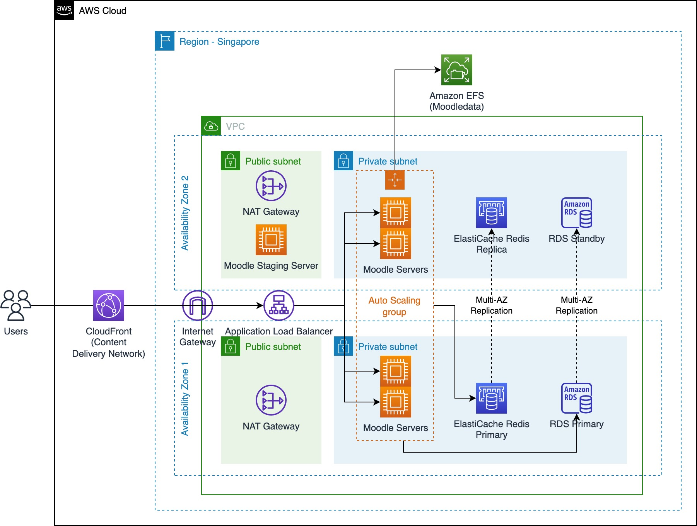

# AWS CDK Scalable Moodle Deployment Template

## Overview

This repository is part of Scalable Moodle on AWS deployment guide. It contains AWS CDK stack that can be used to deploy baseline infrastructure for Scalable Moodle deployment on AWS. The purpose is to save time in deploying the required baseline infrastructure for a scalable Moodle deployment on AWS.

Once the baseline infrastructure is deployed, administrator can continue with installing the Moodle software on top of Moodle Staging Server, and then configure the pre-defined auto-scaling group to use the latest Amazon EC2 AMI from the Moodle Staging Server.

The following is the architecture diagram for the CDK stack.

## Prerequisites

1. Install and configure AWS CLI with your IAM user and your preferred region: https://aws.amazon.com/cli/
2. Install CDK: https://docs.aws.amazon.com/cdk/v2/guide/getting_started.html#getting_started_install
3. Create / import a key pair using Amazon EC2: https://docs.aws.amazon.com/AWSEC2/latest/UserGuide/create-key-pairs.html

## Deployment Steps

1. Configure the `keyName` property under `bin/cdk.ts` file with they Amazon EC2 key pair name that you've created in the prerequisites step
2. Run `npm install`
3. Run `cdk bootstrap` to bootstrap CDK toolkit (You only need to perform this once)
4. Run `cdk deploy` to deploy the CDK stack
5. Once successfully deployed, you can continue to install Moodle software on top of the infrastructure.

## Cleanup

You can run `cdk destroy` to delete the CDK stack.